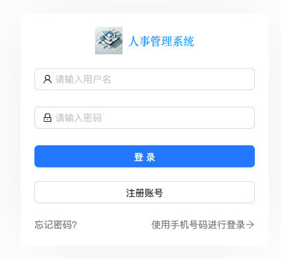

<h1>Staff Management System</h1>
<h2>A comprehensive staff management system based on React, featuring attendance tracking, department management, and analytics dashboard.</h2>

<div align="center">
  
</div>

<h3>✨ Features</h3>

<h4>1. User Authentication</h4>
<div>
Account password login and SMS verification code login<br/>
Password recovery functionality<br/>
User registration system
</div>

<div align="center">

</div>

<h4>2. Data Analysis Dashboard</h4>
<div>
Employee demographics visualization<br/>
Age distribution charts<br/>
Department staff distribution<br/>
Senior staff tracking
</div>

<h4>3. Department Management</h4>
<div>
Hierarchical department structure<br/>
Department tree visualization<br/>
Department CRUD operations
</div>

<h4>4. Staff Management</h4>
<div>
Comprehensive staff information management<br/>
Staff filtering and search<br/>
Avatar upload functionality<br/>
Staff performance assessment
</div>

<h4>5. Attendance System</h4>
<div>
Attendance tracking and recording<br/>
Violation monitoring and reporting<br/>
Attendance statistics visualization
</div>

<h4>👋🏻 Additional Features</h4>
<div>
Salary management<br/>
Reward and punishment records<br/>
Position level management
</div>


<h3>Project Structure</h3>
```text
src/
├── api/                # API interface modules
├── assets/             # Static resources
├── components/         # Reusable components
├── layouts/            # Layout components
├── models/             # Data models
├── pages/              # Page components
│   ├── dashboard/      # Analytics dashboard
│   ├── department/     # Department management
│   ├── staff/          # Staff management
│   └── users/          # User authentication
└── utils/              # Utility functions
```


<h3>🤖 Tech Stack</h3>
Based on @umijs/max V4<br/>
React 18<br/>
TypeScript 5.0+<br/>
ECharts Visualization<br/>
Axios HTTP Client<br/>
Day.js Time Processing<br/>


<h3>Quick Start</h3>
1. Environment Setup
Node.js (18.0.0 or above)<br/>
npm or yarn<br/>
VSCode Editor recommended
2. Installation and Launch
Clone the project
```bash
git clone [repository-url]
cd [project-folder]
```
Install dependencies
```bash
# Using npm
npm install

# Or using yarn
yarn install
```
Start the project
```bash
# Development environment (all commands below are equivalent)
npm start
# or
npm run dev
# or
yarn dev
```
Build the project
```bash
# Production build
npm run build
# or
yarn build
```


<h3>Development Guide</h3>
```bash
This project uses UmiJS Max scaffold, max setup runs automatically after initial installation
Development server runs on http://localhost:8000 by default
TypeScript is used throughout the project, ensure code complies with type definitions
Visualization implemented with ECharts, supporting various data charts
Organization structure uses react-org-tree component
```


<h3>Important Notes</h3>
```bash
Ensure Node.js version meets requirements
If dependency installation fails, try deleting node_modules and reinstalling
Maintain proper TypeScript type definitions during development
Complete necessary code checks before committing
```


<h3>Configuration</h3>
Project uses TypeScript configuration, see tsconfig.json. Custom type definitions are in typings.d.ts.


<h3>API Documentation</h3>
API modules are located in src/api directory:
```bash
adminApi.js - Administrative operations
attendanceApi.js - Attendance management
departmentApi.js - Department operations
staffApi.js - Staff management
userApi.js - User authentication and management
```


<h3>Contributing</h3>
Fork the repository</br>
Create your feature branch (git checkout -b feature/AmazingFeature)</br>
Commit your changes (git commit -m 'Add some AmazingFeature')</br>
Push to the branch (git push origin feature/AmazingFeature)</br>
Submit a Pull Request</br>

