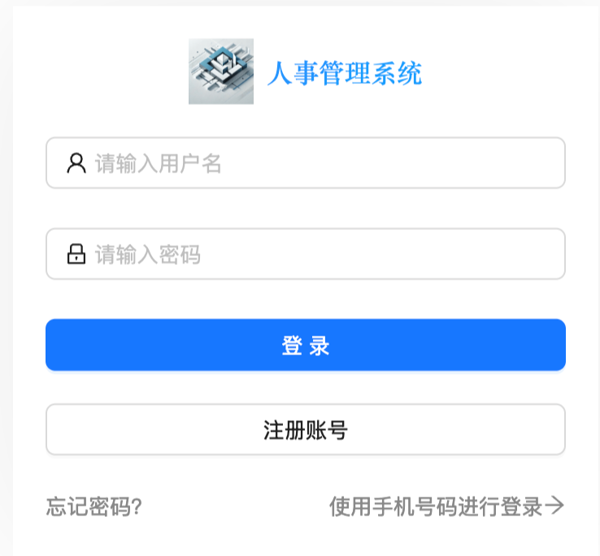
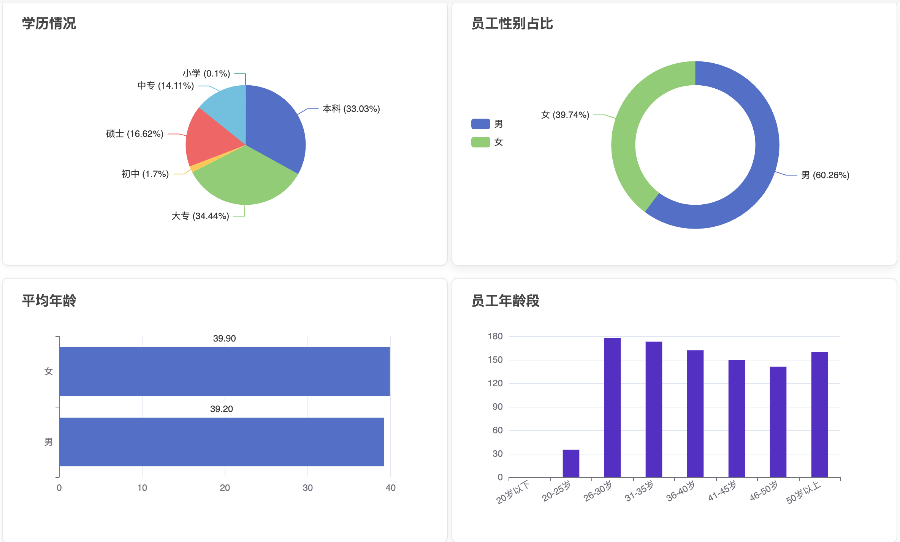
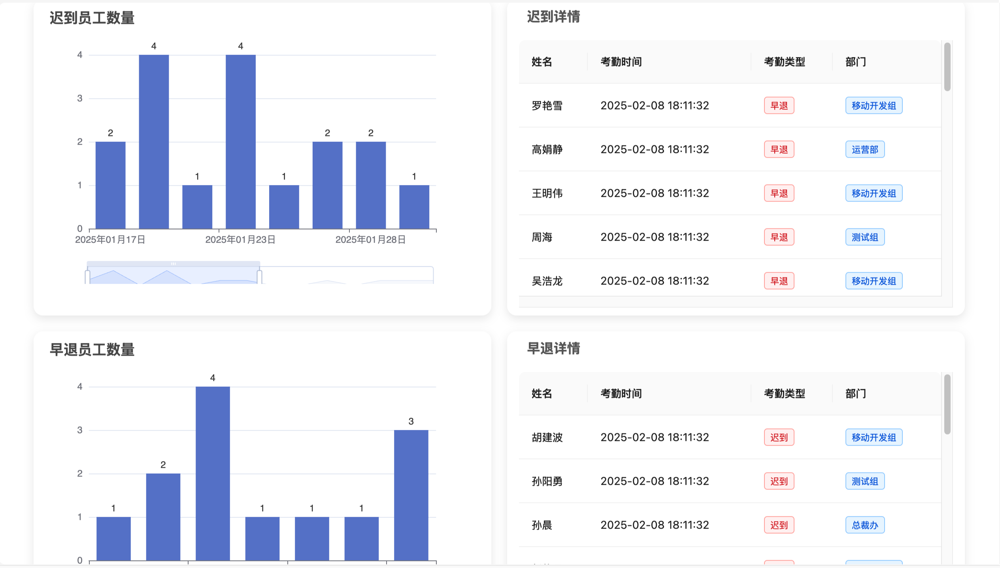
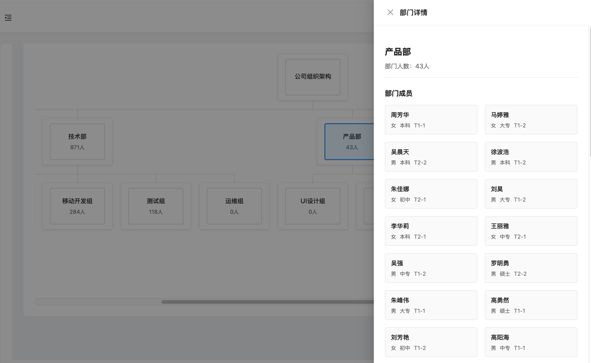
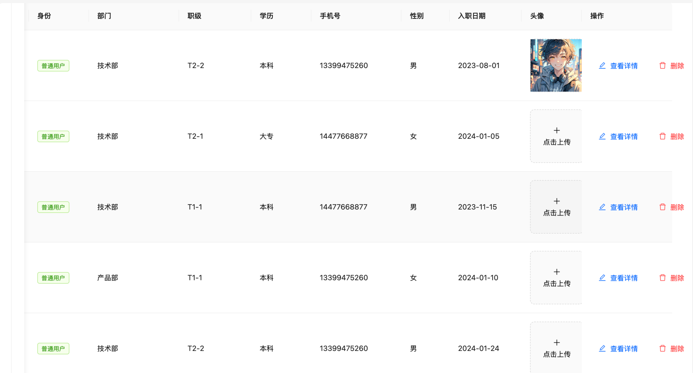

<div align="center">

# 🏢 Employee Management System

#### A Modern Employee Management System Based on React, Providing Comprehensive Human Resource Management Solutions

#### *"React + UmiJS + JavaScript + ECharts"*

🌐 [English](./README.md) · [简体中文](./README_zh-CN.md) · [Backend Repository](https://github.com/AriaZhao-coder/AdminSystemServer.git)


</div>

## 📝 Overview

`Employee Management System` is a **feature-rich** and **user-friendly** management system designed for modern enterprise human resource management needs. Built on React and UmiJS, it provides an intuitive user interface and powerful data analysis capabilities, helping enterprises better manage employee information, track attendance records, and gain deep insights into organizational structure through data visualization.

## 🌟 Core Features

- **👤 Smart User Authentication**: Diverse login methods and secure user authentication
- **📊 Data Analysis Dashboard**: Intuitive data visualization and real-time statistics
- **👥 Employee Information Management**: Comprehensive employee records and performance tracking
- **🏢 Department Management System**: Flexible organizational structure management
- **⏰ Attendance Tracking System**: Precise attendance records and statistical analysis
- **💰 Comprehensive Salary Management**: Complete payroll calculation and rewards/penalties recording

## 🛠️ Technology Stack

- **📚 Framework**: React 18 + UmiJS Max V4
- **🔧 Language**: JavaScript
- **📊 Visualization**: ECharts
- **🌐 Network**: Axios
- **⏱️ Utility Library**: Day.js
- **🎨 UI Components**: Ant Design

## 🔐 Access Control

**Administrator Permissions (👑 Admin)**

✅ View all employee information<br>
✅ Add employee records<br>
✅ Edit employee basic information<br>
✅ Delete employee records<br>
❌ Modify employee avatars

**Regular User Permissions (👤 User)**

✅ View personal information<br>
✅ Modify personal avatar<br>
❌ View others' information<br>
❌ Add/Edit/Delete employee information<br>

## Feature Details

### 1. 🔐 User Authentication Module

- **Multiple Login Methods**
    - Username and password login
    - SMS verification code login
- **Security Management**
    - Password reset
<div align="center">

</div>

### 2. 📈 Data Analysis Dashboard

- **Personnel Distribution**
    - Department headcount statistics
    - Age structure analysis
    - Gender and zodiac distribution
    - Education distribution chart
<div align="center">

</div>

- **Attendance Analysis**
    - Abnormal attendance tracking
<div align="center">

</div>

### 3. 🏢 Department Management Features

- **Organizational Structure**
    - Multi-level department management
    - Tree structure display
    - Department personnel configuration
<div align="center">

</div>


### 4. 👥 Employee Profile Management

- **Information Management**
    - Basic information maintenance
    - Employee avatar modification
    - New employee information
<div align="center">

</div>

## 🚀 Quick Start

### Requirements

- Node.js 18.0.0+
- npm or yarn
- VSCode (recommended)

### Installation Steps

1. **Clone the Project**
```bash
git clone https://github.com/AriaZhao-coder/EmployeeManagementSystem.git
cd employee-management-system
```

2. **Install Dependencies**
```bash
# Using npm
npm install

# Or using yarn
yarn install
```

3. **Start the Project**
```bash
# Development environment
npm start
# Or
yarn dev
```

4. **Build the Project**
```bash
# Production environment
npm run build
# Or
yarn build
```

## 📁 Project Structure

```bash
src/
├── api/                 # API interface definitions
│   ├── admin.ts        # Admin interfaces
│   ├── attendance.ts   # Attendance interfaces
│   └── employee.ts     # Employee interfaces
├── assets/             # Static resources
├── components/         # Common components
├── layouts/            # Layout components
├── models/             # Data models
├── pages/              # Page components
└── utils/              # Utility functions
```

## ⚙️ Configuration Guide

### 1. **Development Environment Configuration**

```yaml
server:
  port: 8000
  host: localhost

api:
  baseURL: /api
  timeout: 5000

upload:
  maxSize: 5242880  # 5MB
  allowTypes: ['image/jpeg', 'image/png']
```

### 2. **Build Configuration**


```javascript
export default {
  antd: {},
  access: {},
  model: {},
  initialState: {},
  request: {},
  layout: {
    title: 'Employee Management System',
  },
}
```

## 🎯 Best Practices

1. **Code Standards**
- Follow JavaScript conventions
- Use ESLint for code checking
- Maintain pure function component design

2. **Performance Optimization**
- Implement component lazy loading
- Use React.memo for render optimization
- Properly utilize useMemo and useCallback


## 🤝 Contributing

1. Fork the repository
2. Create your feature branch (`git checkout -b feature/AmazingFeature`)
3. Commit your changes (`git commit -m 'Add: new feature'`)
4. Push to the branch (`git push origin feature/AmazingFeature`)
5. Open a Pull Request

## 📞 Technical Support

For questions or suggestions, please contact:
- 📧 [Aria Zhao](mailto:yizhao1027@163.com)

## 📄 License

This project is licensed under the [MIT License](LICENSE).

---
