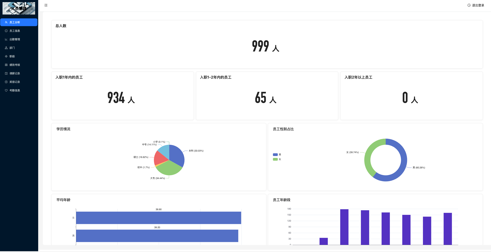
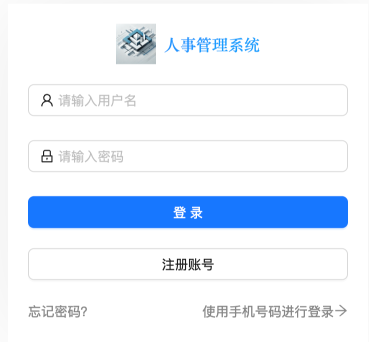
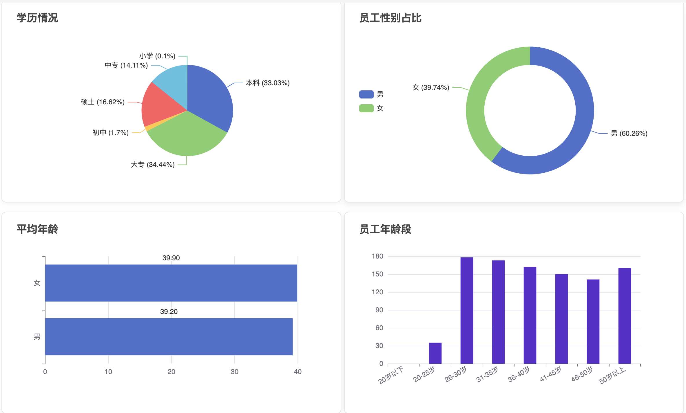
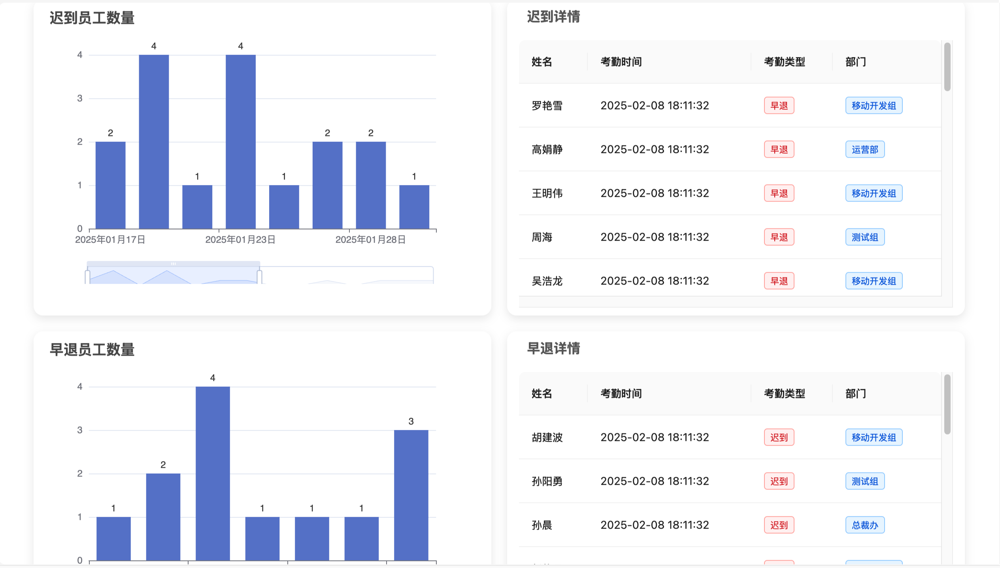
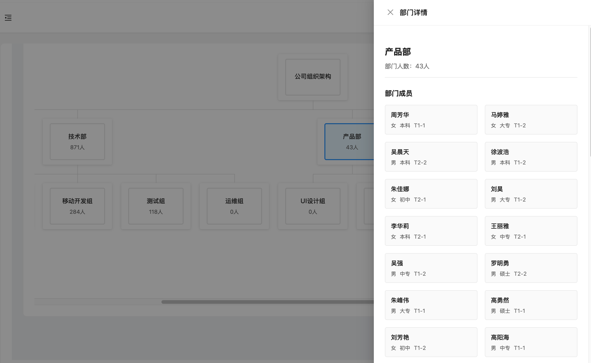
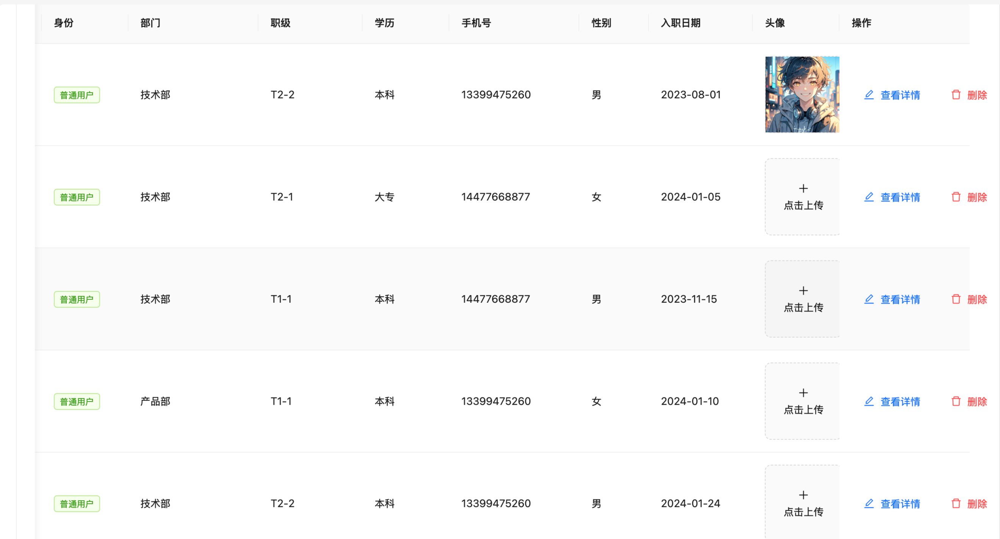

<div align="center">

# 🏢 Employee Management System

#### 基于 React 的现代化员工管理系统，提供全面的人力资源管理解决方案

#### *"React + UmiJS + JavaScript + ECharts"*

🌐 [English](./README.md) · [简体中文](./README_zh-CN.md) · [后端地址](https://github.com/AriaZhao-coder/AdminSystemServer.git)





</div>

## 📝 概述

`Employee Management System` 是一个**功能丰富**且**易于使用**的员工管理系统，专为现代企业的人力资源管理需求设计。本系统基于 React 和 UmiJS 构建，提供了直观的用户界面和强大的数据分析功能，帮助企业更好地管理员工信息、跟踪考勤记录，并通过数据可视化深入了解组织结构。

## 🌟 核心功能

- **👤 智能用户认证**：多样化的登录方式和安全的用户认证
- **📊 数据分析仪表板**：直观的数据可视化和实时统计
- **👥 员工信息管理**：全面的员工档案和绩效跟踪
- **🏢 部门管理系统**：灵活的组织架构管理
- **⏰ 考勤追踪系统**：精确的考勤记录和统计分析
- **💰 综合薪资管理**：完整的薪资核算和奖惩记录

## 🛠️ 技术栈

- **📚 框架**：React 18 + UmiJS Max V4
- **🔧 语言**：JavaScript 
- **📊 可视化**：ECharts
- **🌐 网络**：Axios
- **⏱️ 工具库**：Day.js
- **🎨 UI组件**：Ant Design

🔐 权限控制

管理员权限（👑 Admin）

✅ 查看所有员工信息<br>
✅ 新增员工档案<br>
✅ 编辑员工基本信息<br>
✅ 删除员工记录<br>
❌ 修改员工头像

普通用户权限（👤 User）

✅ 查看个人信息<br>
✅ 修改个人头像<br>
❌ 查看他人信息<br>
❌ 增删改员工信息<br>

## 功能详解

### 1. 🔐 用户认证模块

- **多方式登录**
  - 账号密码登录
  - 短信验证码登录
- **安全管理**
  - 密码重置
<div align="center">

</div>

### 2. 📈 数据分析仪表板

- **人员分布**
  - 部门人数统计
  - 年龄结构分析
  - 性别星座占比
  - 学历分布图表
<div align="center">

</div>

- **考勤分析**
  - 异常考勤追踪
<div align="center">

</div>

### 3. 🏢 部门管理功能

- **组织架构**
  - 多级部门管理
  - 树形结构展示
  - 部门人员配置
<div align="center">

</div>


### 4. 👥 员工档案管理

- **信息管理**
  - 基础信息维护
  - 员工头像修改
  - 新增员工信息
<div align="center">

</div>

## 🚀 快速开始

### 环境要求

- Node.js 18.0.0+
- npm 或 yarn
- VSCode（推荐）

### 安装步骤

1. **克隆项目**
```bash
git clone https://github.com/AriaZhao-coder/EmployeeManagementSystem.git
cd employee-management-system
```

2. **安装依赖**
```bash
# 使用 npm
npm install

# 或使用 yarn
yarn install
```

3. **启动项目**
```bash
# 开发环境
npm start
# 或
yarn dev
```

4. **项目构建**
```bash
# 生产环境
npm run build
# 或
yarn build
```

## 📁 项目结构

```bash
src/
├── api/                 # API 接口定义
│   ├── admin.ts        # 管理接口
│   ├── attendance.ts   # 考勤接口
│   └── employee.ts     # 员工接口
├── assets/             # 静态资源
├── components/         # 通用组件
├── layouts/            # 布局组件
├── models/             # 数据模型
├── pages/              # 页面组件
└── utils/              # 工具函数
```

## ⚙️ 配置说明

### 1. **开发环境配置**

```yaml
server:
  port: 8000
  host: localhost

api:
  baseURL: /api
  timeout: 5000

upload:
  maxSize: 5242880  # 5MB
  allowTypes: ['image/jpeg', 'image/png']
```

### 2. **构建配置**


```javascript
export default {
  antd: {},
  access: {},
  model: {},
  initialState: {},
  request: {},
  layout: {
    title: '员工管理系统',
  },
}
```

## 🎯 最佳实践

1. **代码规范**
  - 遵循 javaScript 规范
  - 使用 ESLint 进行代码检查
  - 保持组件纯函数设计

2. **性能优化**
  - 实现组件懒加载
  - 使用 React.memo 优化渲染
  - 合理使用 useMemo 和 useCallback


## 🤝 参与贡献

1. Fork 本仓库
2. 创建分支 (`git checkout -b feature/AmazingFeature`)
3. 提交更改 (`git commit -m 'Add: 新特性'`)
4. 推送分支 (`git push origin feature/AmazingFeature`)
5. 提交 Pull Request

## 📞 技术支持

如有问题或建议，请联系：
- 📧 Email: yizhao1027@163.com

## 📄 许可证

本项目基于 [MIT 许可证](LICENSE) 开源。

---
